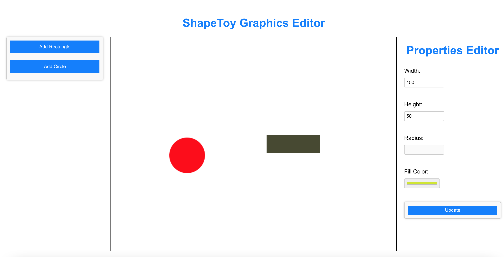

# Shape Toy Web Graphics Editor

Welcome to the ShapeToy Graphics Editor, a simple web-based application for creating and editing shapes on a canvas.



## Demo
Here is a quick video demo going over the core functionality of the project: https://youtu.be/XCHFK9sCduI

## Features

- Create and edit rectangles and circles.
- Select and manipulate shapes.
- Adjust shape properties like width, height, radius, and fill color.

## Usage
- Click "Add Rectangle" or "Add Circle" to create shapes on the canvas.
- Click a shape to select it. Hold down the Shift key to select multiple shapes.
- Adjust shape properties in the Property Editor on the right.
- Drag shapes on the canvas by clicking and dragging them.

## Getting Started

In order to run the project on your local machine:

1. Clone the repository to your local machine:

   ```bash
   git clone https://github.com/RaySCS/shape-toy-graphics-editor.git

2. Navigate to the project directory:
   
   ```bash
   cd shape-toy-graphics-editor

3. Install the project dependencies 
   
   ```bash
   npm install
   
4. Start the development server
   
   ```bash
   npm start

5. Open [http://localhost:3000](http://localhost:3000) to view it in your browser.


